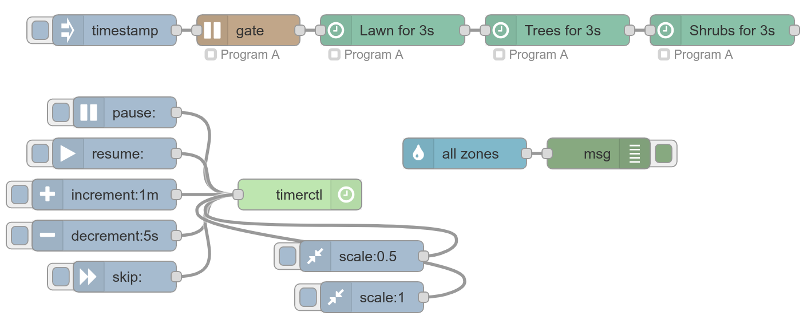
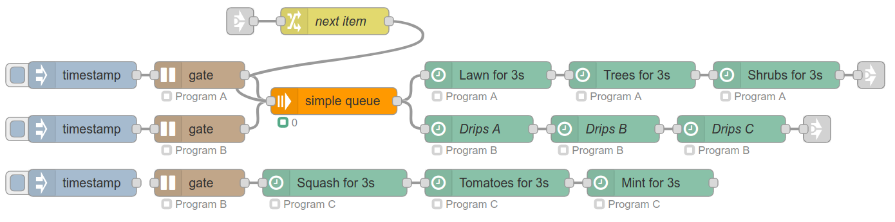
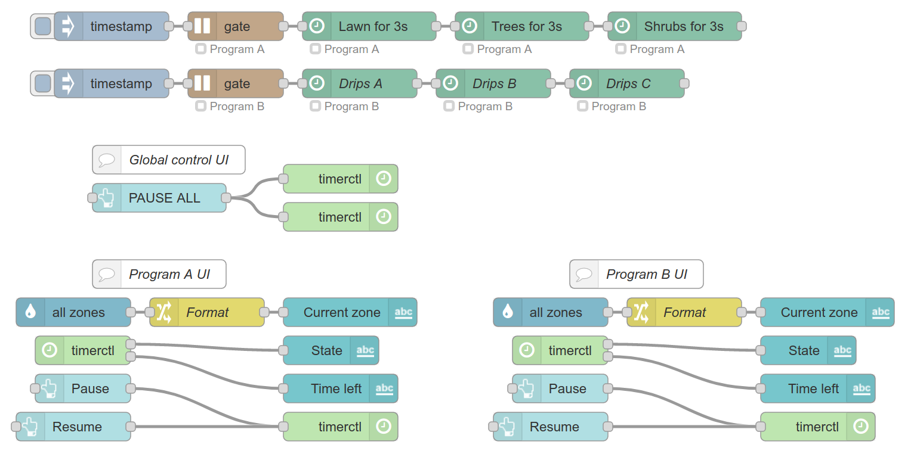
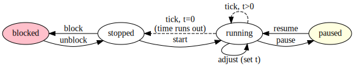
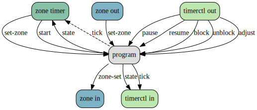

# Node-red-contrib-sprinkler

Looking for more flexibility than your dumb sprinkler controller provides? Use Node-RED flows to:

:crystal_ball: Use custom sensors and weather data to adjust watering based on rain levels, humidity, and forecasts\
:sunny: Set different schedules for summer and winter, or May and June\
:bell: Send notifications when a zone turns on or when a program runs\
:desktop_computer: Use your own UI or customize one of the examples\
:robot: Connect to OpenSprinkler, MQTT, or GPIO pins. Hardware independent!\
:brain: Use machine learning to optimize your watering schedule †\
:exploding_head: Connect Node-RED nodes to accomplish whatever your imagination desires

*Disclaimer: Most of these tasks require additional nodes outside those provided by this library. Knowledge of Node-RED and mental labor required.*

------
*† Maybe linear regression with weather data? Please don't make me use tensorflow.*

## Getting started

> **Note:** All of these screenshots are from examples within the library. In Node-RED, click the menu on the top-right, then Import -> Examples -> node-red-contrib-sprinkler.

Create a sequence of **zone timer** nodes. Here, each timer duration is set to `3s`.
To create the sequence, you'll need to define a **program** configuration. Programs here are very similar to the concept of "program" traditionally used in irrigation systems: A program is a sequence of zones turned on for different durations. There are some more things to know about programs, but these will be explained later.

For debugging, connect an inject node to the beginning so you can trigger the program. In a real flow, you likely set the inject node to repeat at a certain time and on certain days. For more control, you may wan to use an advanced timer node like [eztimer](https://flows.nodered.org/node/node-red-contrib-eztimer) or [bigtimer](https://flows.nodered.org/node/node-red-contrib-bigtimer). More advanced timers allow you to trigger only during certain months/seasons, randomize start times, make exceptions for certain dates, and much more! Note that for **eztimer** you'll want to set *"Timer Type"* to trigger only and for **bigtimer** you'll have to put a switch node after to ignore the off events, otherwise your program will run twice per day!

After you assemble your schedule, you'll likely want to actually control your irrigation hardware. A **zone in** node will send messages whenever a zone turns on or off. You can connect it to:

- a debug node for debugging
- the built-in **opensprinkler** node if your device runs OpenSprinkler
- a template node to transform the zone name into an MQTT topic and then an MQTT node
- an http request node, GPIO control node, or anything else you can imagine

> **Note:** While you can in theory have node-red running on one machine and control hardware an another machine over the network, it is best to run node-red directly on the hardware controlling your sprinklers. If your network fails, your sprinklers can keep running!

### Timer control

Sometimes you may wish to temporarily pause your sprinkler program if there's a lot of rain. You may also wish to temporarily increase or decrease the amount of time a zone is set to run. You can use a **timerctl out** node to accomplish both these tasks. These actions don't have to be manual. You could connect a weather-detecting node to the **timerctl out** to automatically pause when it is raining! But be sure to uncheck the *"Pause only when program is running"* so that your program doesn't run when paused!

### Gating

What happens if you trigger your program as its already running? You likeley don't want this to happen. Putting a **run-gate** node in front of your **zone-timer** nodes will drop any incoming messages if they are sent while the program is running.

> **Note:** You *definitely* don't want a program to be triggered while it is already running, as each program has only one timer and that timer cannot be timing multiple things at once. If sent a message while the program is running, **zone-timer** nodes will throw an error and drop the message. However, to avoid error messages and enable you to put other node-red nodes at the beginning of your program, it is best to put a **run-gate** at the very beginning.

## Advanced flow

In the examples here with two programs, it has been assumed each program is for a different system, each with its own water source. For example, you may have a systems of sprinklers for the lawn and drips for the plants. However, programs will typically share the same water source, and you'll want to ensure no two programs run at the same time.

### Queue

To ensure no two programs run at once, you can route incoming messages through a queue. [Simple-message-queue](https://flows.nodered.org/node/node-red-contrib-simple-message-queue) has a good queue node for this purpose. At the beginning of the program, the triggers will enter the queue. One will pass through (make sure you turn on *"bypass first message"* for this!), and the rest will wait in line. After each program finishes, route the message into a change node, set `msg.reset`, and pass the message into the queue node to release the next trigger waiting in line.

You may be rightly concerned that the queue node is connected to two different nodes. When the message is released from the queue, it will be sent to both nodes! Why don't they both turn on? The **run-gate** node sets `msg.program` to the program's name. **zone-timer** nodes will check this property and drop the incoming message if it is meant for a different program. If instead of a **zone-timer** you put a different node after the queue, make sure to put a switch node or simply add another **run-gate** between the queue and your node to drop messages meant for other programs.

### Multiple zones per timer

In most cases, you probably want zones to turn on one by one. But what if you'd like two zones to be on while a timer is running? The **zone-out** node acts as a simple switch to immediately turn a node on or off, without doing any timing. You can add one node before and one node after your timer, as shown in the above example, to run a second zone concurrently with the timer. In the example, both the "Tiny tomatoes" and "Huge tomatoes" zones will be on at the same time.

## Dashboards

You may be curious what your sprinkler setup is doing behind your back. Perhaps you'd like to know which zones are on or how much more time a zone will be on for. You can use both the **zone in** and **timerctl in** nodes to connect to dashboard labels.

This example uses the [node-red-dashboard](https://flows.nodered.org/node/node-red-dashboard) module. You can make a much more complex dashboard than this example, so make sure to check out the module documentation!

## Node Documentation

There's a lot of it, so it's best to just install the extension then view the docs insine Node-RED's Help pane.

### Duration format

This library uses the same duration format as [eztimer](https://github.com/mrgadget/node-red-contrib-eztimer#times). Here are some examples of valid formats:
* `45` (number or string) - 45 seconds
* `5h 4m 45s` (string) - 5 hours, 4 minutes, 45 seconds
* `5:04:45` (string) - 5 hours, 4 minutes, 45 seconds
* `5:04` (string) - 5 hours, 4 minutes

The code for durations is shamelessly copied form eztimer, so huge thanks to that project.

## How it works

From a technical standpoint, each node (**zone-timer**, **zone-in**, **zone-out**, etc) is merely a simple interface to its connected **program** configuration node. The program node serves as a combination of a state machine and message bus.

### Program state machine

Each program runs a timer. A visual representation of the various states of the timer are shown above. Both **zone-timer** and **timerctl out** nodes cause the state machine to transition. A **zone-timer** will issue the "start" transition, upon which the timer will start ticking and move itself back to the "stopped" state when the timer reaches zero. The **timerctl out** issues the "resume" and "pause" transitions, and if the *"Pause only when program is running"* option is checked, messages with pause & reset topics will cause "block" and "unblock" transitions as well.

### Program message bus

Another important function of the program is to act as a message bus, which simplifies wiring inside node-red. Whenever a zone is turned on or off, the **zone-timer** or **zone-out** node will send a message to change the zone over the program's message bus. The **zone-in** node will listen for these messages and send the appropriate message to connected nodes.

Above is a depiction of the messages sent to and from the program node internally. The tick connection to **zone-timer** is in dashed style as tick messages are not used for operation, but rather for updating the node's status displayed in the Node-RED editor.
